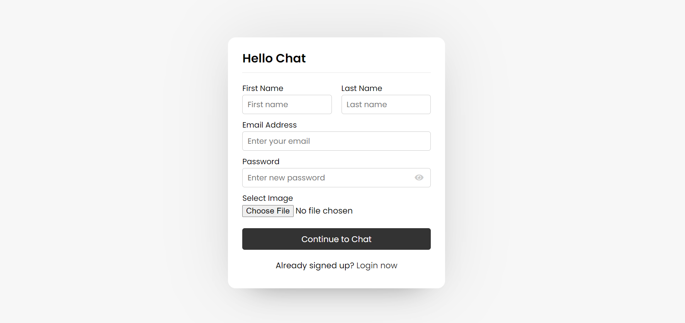
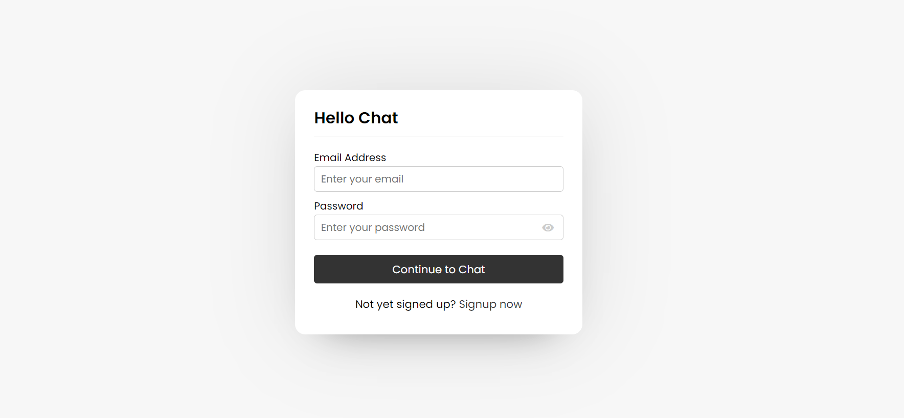
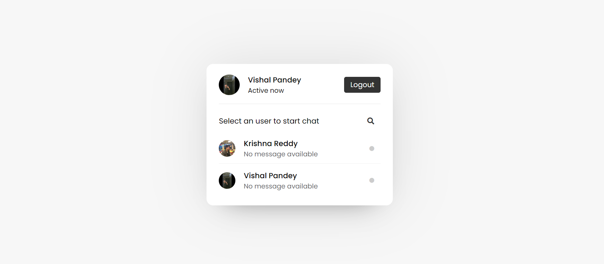
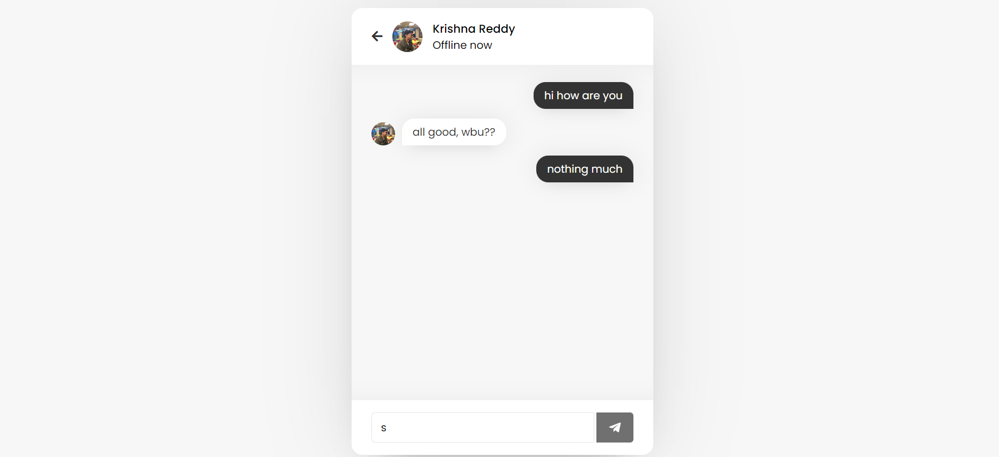

# HelloChat ChatApp

HelloChat ChatApp is a simple chat application built using HTML, CSS, JavaScript, and PHP. It provides users with a platform to chat freely with a beautiful UI and responsive design.

## Features

- Simple and intuitive interface for chatting.
- Beautiful UI design with responsiveness.
- Allows users to chat freely and interactively.

## Setup Instructions

To run the HelloMe ChatApp locally, follow these steps:

1. Import the provided database file (`hellochat.sql`) into your MySQL database.
2. Host the project files on a local server such as Apache or Nginx.
3. Access the application through a web browser using the local server's URL.

## Screenshots

 Signup Page
 
 Login Page
 
 Dashboard
 
  <h5>Chat Interface</h5>
 

## Author
    Vishal Pandey
